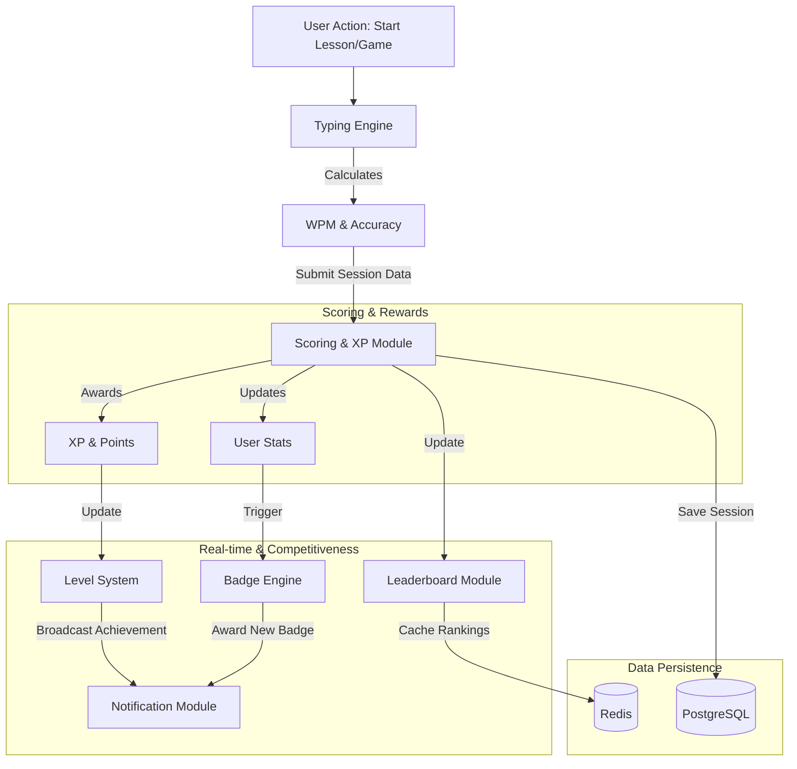

# TypeMaster — System Integration & Event Flow 🧩

This document describes how the core modules of TypeMaster connect and interact. It maps the flow of data from a user's action to its impact on scoring, levels, badges, and leaderboards.

---

## 🛰️ Integration Flow Diagram

The following diagram illustrates how a typing session triggers a chain of events across the system:

---

## 🔗 Module Connectivity Details

### 1. User Actions to Typing Engine
- Every lesson or game starts with a **User Action**.
- The **Typing Engine** captures raw keyboard events and compares them against the `content_text` from the database.

### 2. Typing Engine to Scoring & XP
- On completion, the engine submits a `TypingSession` bundle (user_id, wpm, accuracy, errors, duration).
- The **Scoring Module** applies multipliers (e.g., accuracy > 95% = 1.2x XP).

### 3. Scoring & XP to Stats & Levels
- **XP** is added to the total `user.xp`.
- If `new_xp` exceeds the threshold for `user.level + 1`, a **Level Up** event is fired.
- **UserStats** (best WPM, avg Accuracy) are updated incrementally to avoid heavy recalculations.

### 4. Stats to Badge Engine
- The **Badge Engine** runs a listener or a scheduled check on `UserStats` and `TypingSession` records.
- If conditions are met (e.g., "WPM > 100"), the engine inserts a record into `user_badges`.

### 5. Scoring to Leaderboard & Notifications
- **Leaderboards** are updated instantly in **Redis** via sorted sets for high-performance ranking.
- Achievements (Level Ups, New Badges) trigger **Socket.IO** events to provide real-time feedback to the user and their friends.

---

## 🛠️ Design Patterns used for Integration

- **Event-Driven Architecture**: One module emits an event (e.g., `SessionCompleted`), and others listen to it.
- **Micro-batching for Analytics**: Stats are updated incrementally to maintain performance.
- **Caching-First Leaderboards**: Redis handles all real-time rankings, with periodic persistence to PostgreSQL.
